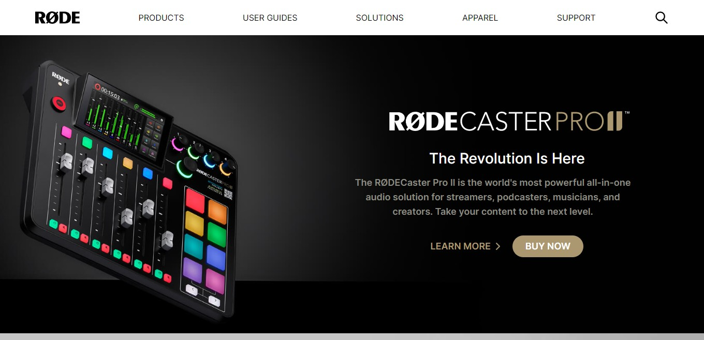

## ⭐Responsive Rode Website Clone Using Tailwind CSS⭐

 

## 📌 Live Site URL: <a href="https://rodeclonetailwind.netlify.app/">**Visit Now**</a>

 

## 📌 Screenshot:

 

## 📌 What I Learned:

- ### Creating responsive website using Tailwind breakpoints
- ### Explored Tailwind documnetation
- ### Tried to make as responsive as original rode.com website.
- ### Flexbox properties in Tailwind

 

## 📌 Time Taken To Complete This Project:

- ### Took me 10+ hours to make it

 

## 📌 Social Links:

